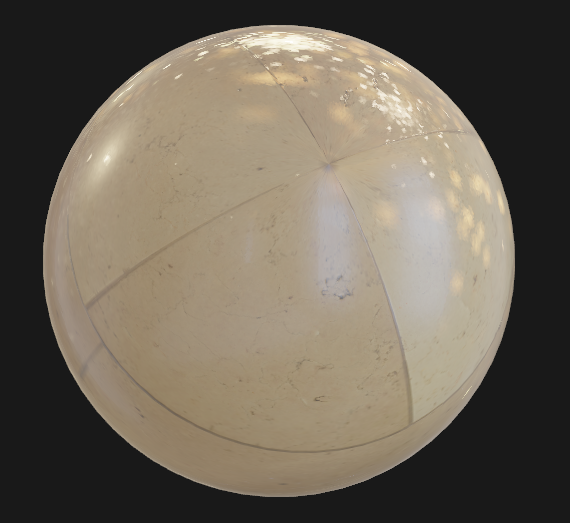
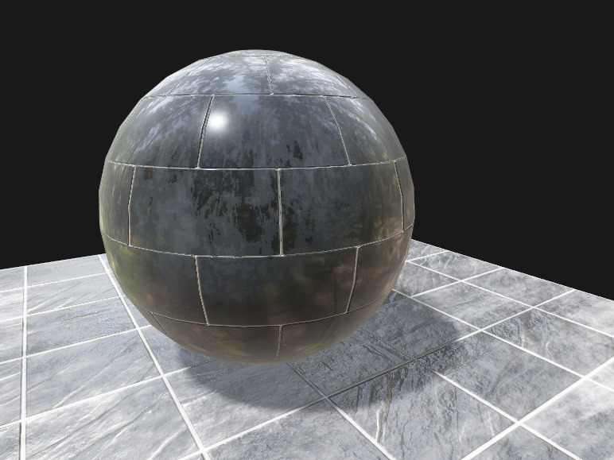
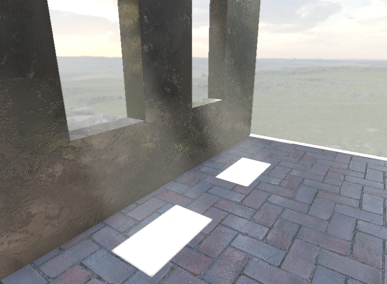

# Realtime Forward PBR renderer (made with Vuk)

- [x] Basic PBR
- [x] Image-based lighting
- [x] Cascaded shadow maps
- [x] SSAO
- [x] Volumetric light scattering/fog (2 different implementations)
- [ ] Basic skybox
- [ ] Atmospheric scattering (should replace skybox and volumetric light)
